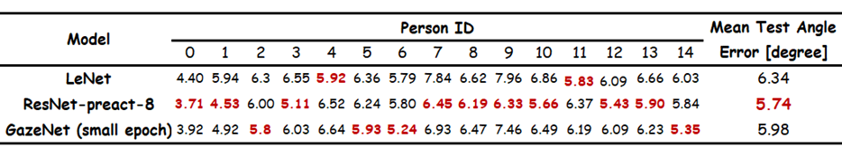
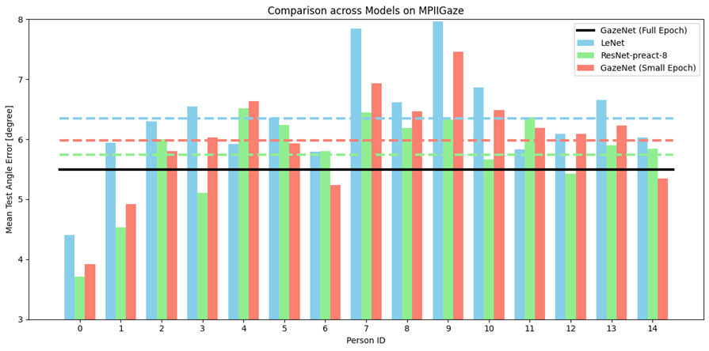

# An unofficial PyTorch implementation of MPIIGaze and MPIIFaceGaze

这个repo由[pytorch_mpiigaze](https://github.com/hysts/pytorch_mpiigaze)衍生而来，旨在在[MPIIGaze](https://paperswithcode.com/dataset/mpiigaze)数据集上尝试各种backbone，分析对比各类方法的性能。**此repo仅用于学习用途。**

同时，本repo也是 [JLU-张振花](https://ccst.jlu.edu.cn/info/1211/19225.htm) 老师开设的[《虚拟现实技术》](https://ccst.jlu.edu.cn/info/1059/3361.htm)课程设计。


## 配置环境 Environment Setup

* Linux (Test on Ubuntu only)
* Python Version = 3.8
* Using Conda Environment

```bash
python ./dlib/setup.py install
pip install -r requirements.txt
```


## 数据集 Dataset & 任务描述 Task

### MPIIGaze

```bash
bash scripts/download_mpiigaze_dataset.sh
```


## 预处理 Preprocess

```
python tools/preprocess_mpiigaze.py --dataset datasets/MPIIGaze -o datasets/
```


## 使用说明 Usage

本项目的参数整理在yaml中，并以模型-训练/测试名命。

训练并测试一组交叉验证（leave one person for test）：

```bash
python train.py --config configs/mpiigaze/lenet_train.yaml
python evaluate.py --config configs/mpiigaze/lenet_eval.yaml
```

完成所有的训练和测试：

```bash
bash scripts/run_all_mpiigaze_lenet.sh
bash scripts/run_all_mpiigaze_resnet_preact.sh
```


## 结果分析 Results Analysis





由于精力限制，我们的GazeNet只训练了15个epoch（原论文为60个），这导致了一定程度上的性能下降（5.50 -> 5.98）


### Demo

该Demo程序对来自网络摄像头的视频运行视线估计。

1. 下载用于地标检测的 dlib 预训练模型。

    ```bash
    bash scripts/download_dlib_model.sh
    ```

2. 校准相机

    将校准结果保存到 [`data/calib/sample_params.yaml`](data/calib/sample_params.yaml).
    
4. 运行Demo

    指定模型路径和相机标定结果路径到[`configs/demo_mpiigaze_resnet.yaml`](configs/demo_mpiigaze_resnet.yaml).
    
    ```bash
    python demo.py --config configs/demo_mpiigaze_resnet.yaml
    ```


## 参考资料 References

* Zhang, Xucong, Yusuke Sugano, Mario Fritz, and Andreas Bulling. "Appearance-based Gaze Estimation in the Wild." Proc. of the IEEE Conference on Computer Vision and Pattern Recognition (CVPR), 2015. [arXiv:1504.02863](https://arxiv.org/abs/1504.02863), [Project Page](https://www.mpi-inf.mpg.de/departments/computer-vision-and-multimodal-computing/research/gaze-based-human-computer-interaction/appearance-based-gaze-estimation-in-the-wild/)
* Zhang, Xucong, Yusuke Sugano, Mario Fritz, and Andreas Bulling. "It's Written All Over Your Face: Full-Face Appearance-Based Gaze Estimation." Proc. of the IEEE Conference on Computer Vision and Pattern Recognition Workshops(CVPRW), 2017. [arXiv:1611.08860](https://arxiv.org/abs/1611.08860), [Project Page](https://www.mpi-inf.mpg.de/departments/computer-vision-and-machine-learning/research/gaze-based-human-computer-interaction/its-written-all-over-your-face-full-face-appearance-based-gaze-estimation/)
* Zhang, Xucong, Yusuke Sugano, Mario Fritz, and Andreas Bulling. "MPIIGaze: Real-World Dataset and Deep Appearance-Based Gaze Estimation." IEEE transactions on pattern analysis and machine intelligence 41 (2017). [arXiv:1711.09017](https://arxiv.org/abs/1711.09017)
* Zhang, Xucong, Yusuke Sugano, and Andreas Bulling. "Evaluation of Appearance-Based Methods and Implications for Gaze-Based Applications." Proc. ACM SIGCHI Conference on Human Factors in Computing Systems (CHI), 2019. [arXiv](https://arxiv.org/abs/1901.10906), [code](https://git.hcics.simtech.uni-stuttgart.de/public-projects/opengaze)

- https://github.com/hysts/pl_gaze_estimation
- https://github.com/hysts/pytorch_mpiigaze_demo
- https://github.com/hysts/pytorch_mpiigaze
